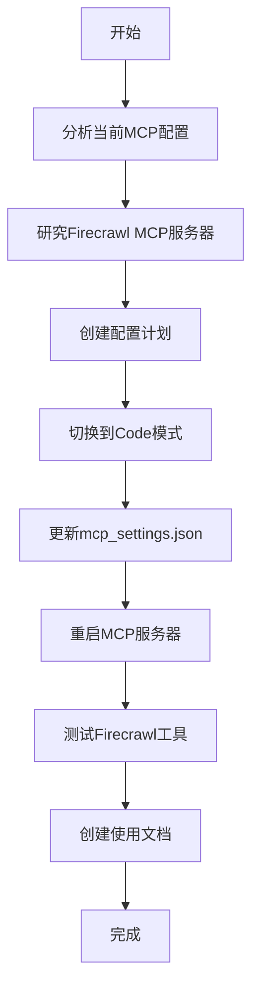

# Firecrawl MCP服务器实施计划

## 任务概述
创建一个Firecrawl MCP服务器配置，使用提供的API密钥：`fc-a32f4ffc8aec4734b68b96d923941d42`

## 当前环境分析
- **项目类型**: Flutter移动应用项目
- **当前MCP配置**: 已配置tavily和github两个MCP服务器
- **MCP设置文件位置**: `C:\Users\25286\AppData\Roaming\Code\User\globalStorage\rooveterinaryinc.roo-cline\settings\mcp_settings.json`
- **操作系统**: Windows 11
- **架构模式限制**: 只能编辑Markdown文件，需要切换到Code模式来编辑JSON文件

## Firecrawl MCP服务器研究结果

### 功能特性
Firecrawl MCP服务器提供以下工具：
1. **firecrawl_scrape** - 从单个URL抓取内容
2. **firecrawl_batch_scrape** - 批量抓取多个URL
3. **firecrawl_check_batch_status** - 检查批量操作状态
4. **firecrawl_map** - 映射网站以发现所有索引URL
5. **firecrawl_search** - 搜索网络并提取内容
6. **firecrawl_crawl** - 启动异步爬取
7. **firecrawl_check_crawl_status** - 检查爬取作业状态
8. **firecrawl_extract** - 使用LLM能力从网页提取结构化信息

### 配置要求
- **必需环境变量**: `FIRECRAWL_API_KEY`
- **可选环境变量**: 
  - `FIRECRAWL_RETRY_MAX_ATTEMPTS` (默认: 3)
  - `FIRECRAWL_RETRY_INITIAL_DELAY` (默认: 1000ms)
  - `FIRECRAWL_RETRY_MAX_DELAY` (默认: 10000ms)
  - `FIRECRAWL_RETRY_BACKOFF_FACTOR` (默认: 2)
  - `FIRECRAWL_CREDIT_WARNING_THRESHOLD` (默认: 1000)
  - `FIRECRAWL_CREDIT_CRITICAL_THRESHOLD` (默认: 100)

## 实施步骤

### 步骤1: 更新MCP设置文件
需要修改 `mcp_settings.json` 文件，添加以下配置：

```json
"firecrawl": {
    "command": "npx",
    "args": [
        "-y",
        "firecrawl-mcp"
    ],
    "env": {
        "FIRECRAWL_API_KEY": "fc-a32f4ffc8aec4734b68b96d923941d42",
        "FIRECRAWL_RETRY_MAX_ATTEMPTS": "5",
        "FIRECRAWL_RETRY_INITIAL_DELAY": "2000",
        "FIRECRAWL_RETRY_MAX_DELAY": "30000",
        "FIRECRAWL_RETRY_BACKOFF_FACTOR": "3",
        "FIRECRAWL_CREDIT_WARNING_THRESHOLD": "2000",
        "FIRECRAWL_CREDIT_CRITICAL_THRESHOLD": "500"
    },
    "alwaysAllow": [
        "firecrawl_scrape",
        "firecrawl_search",
        "firecrawl_map"
    ]
}
```

### 步骤2: 测试配置
1. 保存配置文件后，系统会自动重启MCP服务器
2. 验证Firecrawl工具是否出现在可用工具列表中
3. 测试基本功能是否正常工作

### 步骤3: 创建使用示例
提供常见使用场景的示例：
1. 网页内容抓取
2. 网站映射
3. 网络搜索
4. 数据提取

## 技术细节

### 文件修改位置
当前MCP设置文件内容：
```json
{
    "mcpServers": {
        "tavily": { ... },
        "github": { ... }
        // 需要在此处添加firecrawl配置
    }
}
```

### 修改后的文件结构
```json
{
    "mcpServers": {
        "tavily": { ... },
        "github": { ... },
        "firecrawl": { ... }
    }
}
```

## 风险与注意事项
1. **API密钥安全**: API密钥已硬编码在配置文件中，建议考虑更安全的管理方式
2. **网络连接**: Firecrawl需要网络连接才能工作
3. **速率限制**: 注意API的速率限制和信用使用
4. **Windows兼容性**: 确保npx命令在Windows上正常工作

## 后续步骤
1. 切换到Code模式实施配置更改
2. 测试Firecrawl MCP服务器功能
3. 创建使用文档
4. 验证集成是否成功

## 流程图



## 验收标准
1. Firecrawl MCP服务器成功添加到配置中
2. Firecrawl工具在可用工具列表中可见
3. 基本抓取功能正常工作
4. 提供完整的使用文档