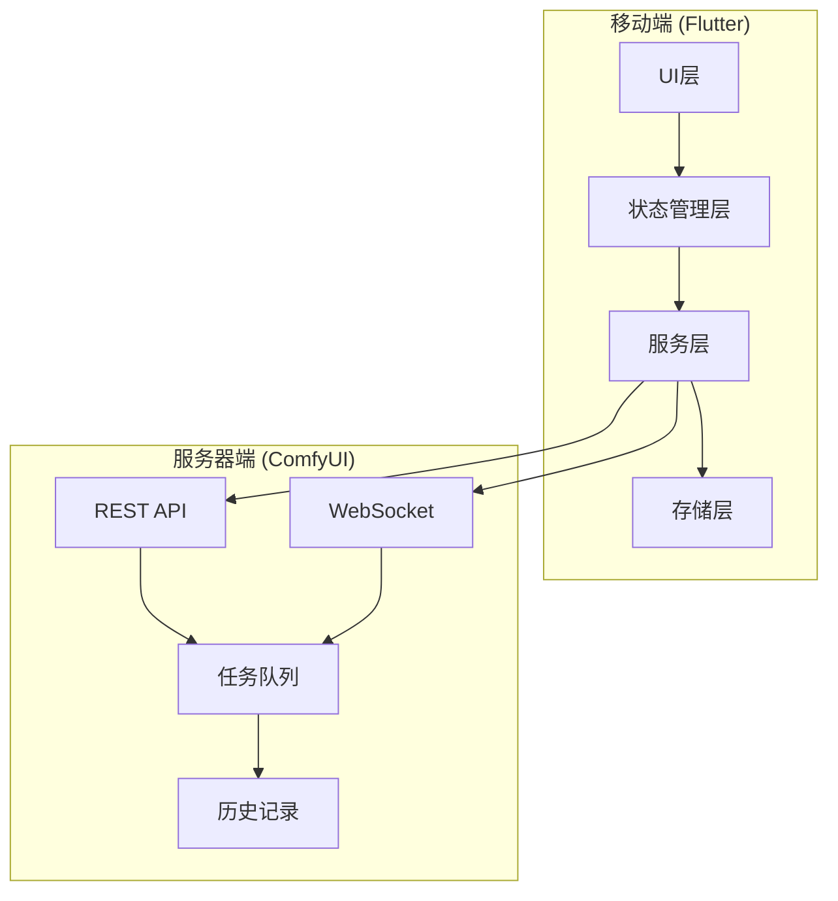

# ComfyUI助手项目分析报告

## 项目概述

**ComfyUI助手**是一个基于Flutter开发的移动端客户端，用于远程连接部署的ComfyUI服务器，在手机端进行工作流管理、参数调节、执行监控及图片查看。

### 核心功能
1. **工作流与参数管理** - 支持JSON导入、动态参数编辑、模型同步、图像上传
2. **实时执行追踪** - WebSocket联动、进度反馈、实时预览、状态找回
3. **图片与历史管理** - 双写存储、本地图库、历史记录、云端同步删除

## 技术架构分析

### 技术栈
- **框架**: Flutter 3.10.3+
- **状态管理**: Provider 6.1.2
- **网络通信**: Dio 5.7.0 + web_socket_channel 3.0.1
- **本地存储**: sqflite 2.4.1 + shared_preferences 2.3.5
- **UI组件**: Cupertino风格 + 自定义毛玻璃效果
- **平台适配**: Android/iOS/Web/Windows/macOS/Linux全平台支持

### 系统架构图



## 详细架构分析

### 1. UI界面架构

#### 导航结构
```
HomePage (底部导航)
├── WorkflowTab (工作流)
│   ├── 服务器连接管理
│   ├── JSON工作流导入
│   ├── 工作流列表展示
│   └── 参数编辑器入口
├── GalleryTab (图库)
│   ├── 瀑布流图片展示
│   ├── 全屏图片查看
│   └── 图片属性查看
└── HistoryTab (历史)
    ├── 执行历史列表
    ├── 历史详情查看
    └── 同步删除功能
```

#### 设计风格
- **iOS风格设计**: 采用Cupertino组件和苹果设计语言
- **毛玻璃效果**: 自定义GlassContainer组件实现磨砂玻璃效果
- **响应式布局**: 适配不同屏幕尺寸和设备方向
- **暗色模式**: 完整的亮色/暗色主题支持

### 2. 数据流与状态管理

#### Provider架构
```dart
MultiProvider(
  providers: [
    ChangeNotifierProvider(create: (_) => SettingsProvider()),  // 设置管理
    ChangeNotifierProvider(create: (_) => HistoryProvider()),   // 历史管理
    ChangeNotifierProxyProvider<HistoryProvider, WorkflowProvider>(  // 工作流管理
      create: (_) => WorkflowProvider(),
      update: (_, history, workflow) => workflow!..setHistoryProvider(history),
    ),
  ]
)
```

#### 核心状态提供者
1. **WorkflowProvider** - 核心业务逻辑
   - 工作流管理（导入、编辑、删除）
   - 服务器连接与通信
   - 实时执行状态跟踪
   - 图片下载与保存

2. **HistoryProvider** - 历史记录管理
   - 本地历史记录CRUD
   - 图片路径管理
   - 分页加载支持

3. **SettingsProvider** - 应用设置
   - 主题模式管理
   - 服务器地址配置
   - 持久化存储

### 3. 网络通信架构

#### REST API层 (ApiService)
- **基础连接**: `/system_stats` 健康检查
- **工作流提交**: `/prompt` 提交工作流到队列
- **历史管理**: `/history` 获取/删除历史记录
- **队列状态**: `/queue` 获取队列状态
- **模型信息**: `/object_info` 获取服务器模型列表
- **图片上传**: `/upload/image` 上传本地图片

#### WebSocket通信 (WebSocketService)
- **实时事件监听**:
  - `status` - 队列状态更新
  - `execution_start` - 执行开始
  - `executing` - 节点执行中
  - `progress` - 进度更新
  - `executed` - 执行完成
- **二进制预览图**: 实时接收生成图片预览
- **自动重连**: 连接断开后3秒自动重连

### 4. 本地存储方案

#### 数据库设计 (SQLite)
```sql
-- 工作流表
CREATE TABLE workflows (
  id TEXT PRIMARY KEY,
  name TEXT NOT NULL,
  content TEXT NOT NULL,
  last_modified INTEGER NOT NULL
)

-- 历史记录表
CREATE TABLE history_records (
  id INTEGER PRIMARY KEY AUTOINCREMENT,
  prompt_id TEXT,
  workflow_json TEXT,
  params_json TEXT,
  image_path TEXT,
  created_at INTEGER
)
```

#### 文件存储策略
1. **应用私有目录**: `Documents/comfy_images/` - 快速加载UI
2. **系统相册**: 通过MediaStore API导出 - 用户可访问
3. **Android适配**: 处理Android 11+分区存储限制

#### 设置存储
- **SharedPreferences**: 存储主题模式、服务器地址等配置
- **键值对**: `themeMode`, `ipAddress`, `port`

### 5. 核心业务流程

#### 工作流执行流程
```
1. 导入JSON工作流文件
2. 解析工作流节点结构
3. 动态生成参数编辑器
4. 连接ComfyUI服务器
5. 获取服务器模型列表
6. 编辑参数（模型选择、提示词、种子等）
7. 提交工作流到队列
8. 通过WebSocket监听执行状态
9. 实时显示进度和预览图
10. 执行完成后下载图片
11. 保存到本地数据库和相册
```

#### 种子逻辑处理
支持四种种子处理模式：
- `randomize` - 随机生成新种子
- `increment` - 当前种子+1
- `decrement` - 当前种子-1
- `fixed` - 保持固定种子

### 6. 平台适配特性

#### Android特定功能
- **分区存储适配**: 使用`saver_gallery`插件处理Android 11+限制
- **动态权限管理**: `permission_handler`处理存储和相册权限
- **后台运行**: `flutter_overlay_window`实现悬浮窗显示进度
- **前台服务**: `flutter_local_notifications`保持后台运行

#### iOS特定功能
- **Cupertino设计**: 原生iOS风格界面
- **照片库访问**: `photo_manager`管理相册权限

### 7. 性能优化策略

#### 图片加载优化
- **缓存策略**: `cached_network_image` + 本地文件缓存
- **分辨率适配**: 根据显示区域动态加载合适分辨率
- **预加载**: 全屏查看前预加载图片

#### 列表性能优化
- **懒加载**: 历史记录和图片列表分页加载
- **复用机制**: `Sliver`系列组件实现高效滚动
- **Hero动画**: 图片查看时的平滑过渡动画

#### 网络优化
- **连接池管理**: Dio内置连接复用
- **超时控制**: 关键API设置超时时间
- **错误重试**: WebSocket自动重连机制

## 项目亮点

### 1. 专业级的UI/UX设计
- 苹果风格的毛玻璃效果
- 流畅的动画和过渡
- 直观的操作反馈（触觉反馈、SnackBar提示）

### 2. 完善的错误处理
- 网络连接失败自动重试
- JSON解析错误友好提示
- 服务器错误信息解析展示

### 3. 强大的实时监控
- WebSocket实时进度更新
- 后台运行状态保持
- 应用生命周期状态恢复

### 4. 跨平台兼容性
- 完整的Android/iOS适配
- Web和桌面端支持
- 统一的代码库维护

### 5. 数据同步机制
- 本地与云端历史记录同步
- 图片双写存储策略
- 删除操作的云端同步

## 改进建议

### 1. 架构优化
- 考虑引入`Riverpod`替代`Provider`以获得更好的类型安全和测试性
- 将业务逻辑进一步分离到Repository层
- 增加单元测试和集成测试覆盖率

### 2. 功能增强
- 支持工作流模板和预设
- 添加批量操作功能
- 实现工作流版本管理
- 增加图片编辑和后期处理功能

### 3. 性能提升
- 实现图片压缩和缩略图生成
- 添加离线模式支持
- 优化数据库查询性能

### 4. 用户体验
- 添加手势操作支持
- 实现深色模式自动切换
- 增加多语言支持（目前已有中英文基础）

## 总结

ComfyUI助手是一个设计精良、功能完整的Flutter移动应用，展示了以下技术特点：

1. **现代Flutter架构**: 采用Provider状态管理，清晰的层次分离
2. **专业UI设计**: 苹果风格设计语言，优秀的用户体验
3. **稳定网络通信**: REST + WebSocket双通道，完善的错误处理
4. **高效本地存储**: SQLite + 文件系统，合理的数据持久化策略
5. **跨平台能力**: 全平台支持，良好的平台适配

该项目为AI图像生成工作流提供了便捷的移动端管理方案，技术实现成熟，架构设计合理，具备良好的可维护性和扩展性。